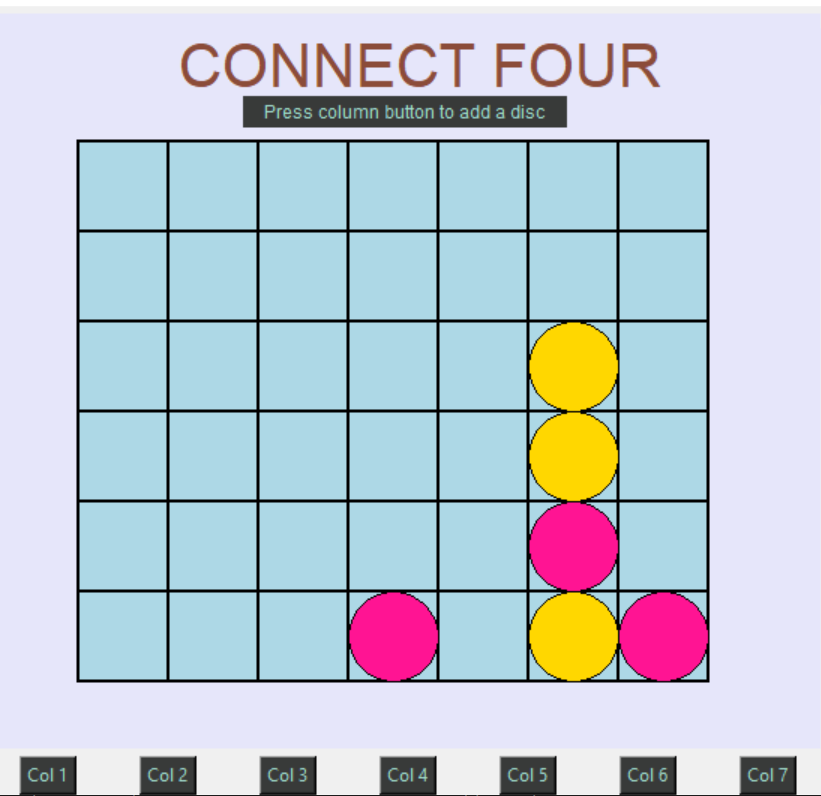

# Four-In-a-Row

Board game developed using Python and Tkinter
In order to play:
1) Download the repository contents and extract into an empty folder
2) Excute the command "Python ./main.py" from within that folder using CMD/BASH
3) Enjoy the game!

* Developed using Python and Tkinter
* Source code is available at the src folder
